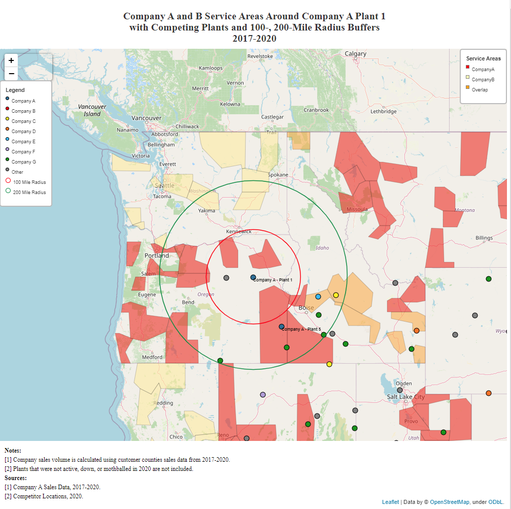

# Mapping-with-Python-Folium

#### Make beautiful maps that can:
1. Plot (longitude, latitude) coordinate points
2. Shade in geographic areas based on the level of a numeric variable (choropleth maps)
3. Shade in geographic areas not based on any numeric variable (service area maps)

#### All you need to do is:
1. Download the git repository to your computer.

2. Download the zipsz geo_json file found here: https://drive.google.com/file/d/1NAtg4xvrJp24_gY9t04eSlAlXjNEYEXD/view?usp=sharing. Save it in the geo_json folder of your local repository.

4. Add data to the "Data" sheets in the Excel files in the ./input folder. You can use the "README" and "Example" tabs for help on how your data should be organized.
    * Start_Maps.xlsx (required) - This is the power center of your map making automation. You put the specs for each map you want made in this file.
    * Lat_Long_Data.xlsx (optional) - Data for plotting coordinates on the map.
    * Color_Map.xlsx (optional) - Can give different coordinates different colors based on a "Label" variable in your Lat_Long_Data.xlsx file.
    * Choro_Map.xlsx (optional) - Shade in geographic areas based on the level of some variable (e.g., choropleth maps).
    * SA_Data.xlsx (optional) - Shade in geographic areas not based on the level of some variable (e.g., service area maps).

5. Run the code in a Jupyter notebook
    * Navigate to the "./programs" directory.
    * Open map_maker.ipynb in a Jupyter notebook.
    * Follow directions in the Jupyter notebook.

6. WATCH THIS VIDEO FOR A DEMONSTRATION: 
